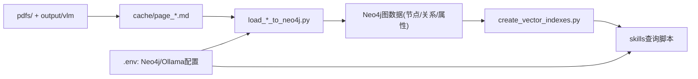

# 项目数据处理梳理（现状 + 风险）

## 1. 文档目标与范围

本文档聚焦当前仓库中“数据处理”实现细节，覆盖以下链路：

- 输入层：`pdfs/`、`output/GB2760-2024/vlm/`、`cache/page_*.md`、`.env`
- 处理层：`load_*` 导入脚本、`embedding_ollama.py`、`run_neo4j_cypher.py`
- 存储层：Neo4j 节点/关系/约束/索引、向量索引
- 消费层：`skills/gb2760-standard-query/scripts/*.py` 查询与检索脚本

不包含内容：

- 上游 PDF/VLM 解析算法实现（仓库中未见完整实现代码）
- 业务规则重定义（仅描述当前代码行为）

---

## 2. 端到端数据流总览

主编排入口：`load_all_data.py`

执行顺序（当前实现）：

1. 清空数据库（保留约束/索引）
2. 执行 `neo4j_schema.cypher`
3. 导入分类（E.1 + A.2）
4. 导入添加剂（A.1）
5. 导入香料（B.2/B.3）
6. 导入不得添加香料名单（B.1 + 脚注例外）
7. 导入加工助剂（C.1/C.2）
8. 导入酶制剂（C.3）
9. 创建向量索引

---

## 3. 输入源与中间层

### 3.1 输入分层

- **原始/上游产物**：`pdfs/GB2760-2024.pdf`、`output/GB2760-2024/vlm/*.json`
- **当前直接入库输入**：`cache/page_*.md`（各导入脚本实际读取来源）
- **运行时配置输入**：`.env`（Neo4j 与 Ollama embedding）

### 3.2 文件分工（关键）

- `load_cache_to_neo4j.py`：A.1 添加剂主数据 + 使用许可
- `load_categories_to_neo4j.py`：E.1 分类系统 + A.2 例外类别
- `load_flavorings_to_neo4j.py`：B.2/B.3 香料清单
- `load_no_flavoring_list_to_neo4j.py`：B.1 不得添加香料名单 + 脚注 a 例外
- `load_processing_aids_to_neo4j.py`：C.1/C.2 加工助剂
- `load_enzymes_to_neo4j.py`：C.3 酶制剂及来源-供体配对

---

## 4. 数据处理链路细节（输入 -> 处理 -> 输出）

## 4.1 编排与基础设施

### `load_all_data.py`

- **输入**：脚本列表 + `.env` + `neo4j_schema.cypher`
- **处理**：
  - `check_neo4j_connection()` 检查连通性
  - `create_schema()` 通过 `split_cypher_statements()` 分句执行 schema
  - `run_script()` 串行执行各导入脚本
- **输出**：完整图数据 + 控制台导入状态
- **异常处理**：步骤失败后支持人工选择是否继续，最终失败集合导致 `exit(1)`

### `run_neo4j_cypher.py`

- **输入**：`.cypher` 文件文本
- **处理**：`split_cypher_statements()` 去注释并按分号切分
- **输出**：逐条执行结果统计
- **异常处理**：单语句失败不阻断整文件执行

## 4.2 向量生成与向量索引

### `embedding_ollama.py`

- **输入**：单条或批量文本
- **处理**：
  - `get_embedding(text)`：单条请求 `OLLAMA_EMBED_URL`
  - `get_embeddings_batch(texts)`：批量请求
  - `text_for_embedding(*parts)`：拼接字段并过滤空值
- **输出**：`List[float]` 或 `None`
- **降级策略**：请求失败返回 `None`（或批量全 `None`），不抛出阻断异常

### `create_vector_indexes.py`

- **输入**：已有 embedding 节点 + Ollama 可用性
- **处理**：
  - `get_embedding_dimension()`：优先问 Ollama，失败则从 Neo4j 现有节点推断
  - `create_vector_indexes(dimension)`：创建各标签向量索引
- **输出**：`chemical_embedding` 等索引
- **异常处理**：索引语法失败时尝试简化语法 fallback

## 4.3 A.1 添加剂（最核心）

### `load_cache_to_neo4j.py`

- **输入**：`cache/*.md`（排除 A.2、E.1 页面）
- **关键结构**：
  - `AdditiveBlock`（名称、CNS/INS、功能、许可）
  - `Permission`（`group` 或 `category`）
- **关键处理**：
  - `parse_additive_blocks()` 解析块与表行
  - `extract_exclude_group()` + `expand_exclude_group()` 解析并展开例外编号
  - `extract_scope_from_name()` 提取名称括号范围限定
  - `chemical_id()` 生成添加剂主键（优先 CNS，再 INS）
  - `load_block()` 入库并创建关系
- **输出**：
  - `Chemical`、`AdditiveCode`、`Function`
  - `PERMITTED_IN`、`PERMITTED_IN_GROUP`
- **异常/降级**：
  - 单条块失败打印后继续
  - embedding 失败时写入不含 embedding 的节点
  - 当前 `main()` 显式“不做噪音过滤”

## 4.4 E.1/A.2 分类系统

### `load_categories_to_neo4j.py`

- **输入**：E.1（`page_244~254.md`）、A.2（`page_149~150.md`）
- **处理**：
  - `parse_e1_file()` 与 `parse_a2_file()`
  - `calculate_level()` 计算层级
  - `build_hierarchy_relationships()` 建 `HAS_SUBCATEGORY`
  - 批量 embedding 后写入分类节点
- **输出**：
  - `FoodCategory`
  - `FoodCategoryGroup(code='FOOD_ADDITIVE_EXCEPTIONS')`
  - `CONTAINS`（含 `exception_no`）
- **异常/降级**：
  - 缺页跳过
  - embedding 缺失不阻断写入

## 4.5 B.2/B.3 香料

### `load_flavorings_to_neo4j.py`

- **输入**：天然香料页（153~167）+ 合成香料页（168~225）
- **处理**：
  - `parse_flavorings_from_content()` 解析表格
  - 代码去重（按 `code`）
  - `load_flavoring()` 写入 `Flavoring`（可带 embedding）
- **输出**：`Flavoring(code,name_zh,name_en,flavoring_type,fema_number,embedding)`
- **异常/降级**：单条失败继续，embedding 失败降级写入

## 4.6 B.1 不得添加香料名单

### `load_no_flavoring_list_to_neo4j.py`

- **输入**：`cache/page_152.md`
- **处理**：
  - 解析 B.1 分类名单
  - 创建 `FoodCategoryGroup(code='NO_FLAVORING_ALLOWED')`
  - 通过 `parse_footnote_a()` 写入脚注例外（特定 `Flavoring -[:PERMITTED_IN]-> FoodCategory`）
- **输出**：
  - `NO_FLAVORING_ALLOWED -[:CONTAINS]-> FoodCategory`
  - 脚注例外关系（带 `max_usage/unit/note/exception_note`）
- **异常/降级**：
  - 若找不到对应 `Flavoring`，只打印警告
  - 脚注 a 当前实现为固定硬编码数据

## 4.7 C.1/C.2 加工助剂

### `load_processing_aids_to_neo4j.py`

- **输入**：`page_226.md`（C.1）+ `page_227~232.md`（C.2）
- **处理**：
  - `parse_processing_aids_c1()` -> `type='unlimited'`
  - `parse_processing_aids_c2()` -> `type='limited'` + 功能/范围/脚注
  - `parse_footnotes()` + `extract_footnote_ref()` 处理脚注
- **输出**：`ProcessingAid` 节点（含类型化字段）
- **异常/降级**：单条失败继续；embedding 失败降级写入

## 4.8 C.3 酶制剂

### `load_enzymes_to_neo4j.py`

- **输入**：`page_233~242.md`
- **处理**：
  - `parse_enzymes_from_content()` 解析主行与续行（`| | |`）
  - `parse_organism_name()` 处理中英混排格式
  - `load_enzyme()` 建立 Enzyme / EnzymeSource / Organism 及关系
  - `_organism_embedding()` 对生物体 embedding 做 cache
- **输出**：
  - `Enzyme`
  - `EnzymeSource(enzyme_code,source_organism,donor_organism)`
  - `Organism`
  - `HAS_SOURCE` / `FROM_ORGANISM` / `USES_DONOR`
- **异常/降级**：
  - 无效来源跳过
  - 允许保留重复来源-供体行（不去重）

---

## 5. 实体与关系数据字典（现状）

## 5.1 节点字典

| 节点标签 | 主键/唯一约束 | 关键属性 | 属性来源 | 可空性与降级 |
|---|---|---|---|---|
| `Chemical` | `id` | `name_zh,name_en,embedding` | A.1 解析块 | `embedding` 可空；失败降级 |
| `AdditiveCode` | `(code_type,code)` | `code_type,code` | A.1 的 CNS/INS 列 | 不可空（有效行） |
| `Function` | `name` | `name,embedding` | A.1 功能列 | `embedding` 可空 |
| `FoodCategory` | `code` | `name,level,embedding` | E.1/A.2 及 A.1 许可行 | `embedding` 可空 |
| `FoodCategoryGroup` | `code` | `name,description` | 固定组代码 + 业务说明 | `description` 可空 |
| `Flavoring` | `code` | `name_zh,name_en,flavoring_type,fema_number,embedding` | B.2/B.3 表格 | `fema_number,embedding` 可空 |
| `ProcessingAid` | `code` | `type,function,usage_scope,note,footnote_ref,sequence_no,embedding` | C.1/C.2 | 限定字段随 `type` 变化 |
| `Enzyme` | `code` | `name_zh,name_en,sequence_no,embedding` | C.3 主行 | `name_en,embedding` 可空 |
| `EnzymeSource` | `(enzyme_code,source_organism,donor_organism)` | 同主键字段 | C.3 来源-供体配对 | `donor_organism` 空时写 `""` |
| `Organism` | `(name_zh,name_en)` | `name_zh,name_en,embedding` | C.3 来源/供体解析 | 单语种名称允许另一侧为空 |

## 5.2 关系字典

| 关系类型 | 起点 -> 终点 | 关键属性 | 来源与转换 |
|---|---|---|---|
| `REFERS_TO` | `AdditiveCode -> Chemical` | 无 | A.1 中 CNS/INS 到 `chemical_id` |
| `HAS_FUNCTION` | `Chemical -> Function` | 无 | A.1 功能拆分后逐条建立 |
| `PERMITTED_IN` | `Chemical -> FoodCategory` | `max_usage,unit,note,scope,category_name` | A.1 许可表行；支持同 `code` 多条 |
| `PERMITTED_IN_GROUP` | `Chemical -> FoodCategoryGroup` | `max_usage,exclude_group,group_rule_description` | A.1 “各类食品...除外”；`exclude_group` 被展开为整数数组 |
| `CONTAINS` | `FoodCategoryGroup -> FoodCategory` | `exception_no`（A.2 场景） | A.2 例外列表或 B.1 名单 |
| `HAS_SUBCATEGORY` | `FoodCategory -> FoodCategory` | 无 | 由 `code` 父子层级推断 |
| `PERMITTED_IN` | `Flavoring -> FoodCategory` | `max_usage,unit,note,exception_note` | B.1 脚注例外 |
| `HAS_SOURCE` | `Enzyme -> EnzymeSource` | 无 | C.3 配对展开 |
| `FROM_ORGANISM` | `EnzymeSource -> Organism` | 无 | C.3 来源生物体 |
| `USES_DONOR` | `EnzymeSource -> Organism` | 无 | C.3 供体生物体（可选） |

---

## 6. 查询与消费层（skills 脚本）

目录：`skills/gb2760-standard-query/scripts/`

### 6.1 向量检索脚本

- `vector_search_food_category.py`
- `vector_search_chemical.py`
- `vector_search_flavoring.py`
- `vector_search_processing_aid.py`
- `vector_search_enzyme.py`

共同模式：

1. `_common.get_embedding()` 生成向量
2. `CALL db.index.vector.queryNodes(index, k, vector)`
3. 返回 JSON 字符串（含 `score`）
4. embedding 失败返回 `[]`

### 6.2 图查询脚本

- 添加剂：`query_additives_for_category.py`、`get_food_categories_for_additive.py`
- 香料：`get_flavorings_for_food_category.py`、`get_food_categories_for_flavoring.py`
- 加工助剂：`get_usage_for_processing_aid.py`、`get_processing_aids_for_food_category.py`
- 酶制剂：`get_sources_for_enzyme.py`
- 名单：`list_no_flavoring_categories.py`

共同模式：

- 输入是 code 或名称关键词（部分脚本支持模糊匹配）
- 执行 Cypher 后统一 `json.dumps(..., ensure_ascii=False)`
- `finally` 中关闭 driver

---

## 7. 异常处理与容错策略（现状）

## 7.1 现有策略

- **连接检查**：多数脚本启动时 `verify_connectivity()`
- **单条容错**：多脚本按记录 `try/except`，失败继续后续导入
- **embedding 降级**：失败返回 `None`，允许无向量写入
- **索引创建降级**：向量索引语法失败后 fallback

## 7.2 一致性观察

- 错误处理风格不完全统一（有的脚本强依赖 stdout 提示）
- 查询脚本多返回空数组，不区分“无结果”和“运行时错误”

---

## 8. 风险点评（按优先级）

## P0（高优先级）

1. **脚注例外硬编码风险**
   - 文件：`load_no_flavoring_list_to_neo4j.py`
   - 现状：`parse_footnote_a()` 返回固定字典，不基于源文本动态解析。
   - 风险：标准版本变更后容易数据过时或不一致。

2. **导入幂等性不完全**
   - 文件：`load_cache_to_neo4j.py`
   - 现状：`PERMITTED_IN`、`PERMITTED_IN_GROUP` 使用 `CREATE`，重复执行会累积重复关系。
   - 风险：重复导入导致查询结果膨胀、统计失真。

3. **“无噪音过滤”依赖上游质量**
   - 文件：`load_cache_to_neo4j.py`
   - 现状：已实现 `is_noise_block()` 但主流程明确不启用。
   - 风险：若 `cache` 混入非目标块，脏数据将直接入库。

## P1（中优先级）

1. **错误语义不统一**
   - 查询脚本多数异常不包装成结构化错误，调用方难区分“空结果/失败”。

2. **加工助剂与食品分类未结构化关联**
   - `get_processing_aids_for_food_category.py` 依赖 `usage_scope/note` 文本匹配，精度受限。

3. **跨脚本重复实现**
   - embedding 与 driver 初始化逻辑在导入层和 skills 层分别存在，维护成本偏高。

## P2（低优先级）

1. **日志体系偏弱**
   - 大量 `print`，缺少统一日志级别、批次 ID、失败重试上下文。

2. **数据质量校验缺少自动化报告**
   - 导入后缺少标准化核对（计数、空值率、重复关系检查）。

---

## 9. 优化建议（P0/P1/P2）

## 9.1 P0 建议（先做）

1. 将 B.1 脚注 a 改为文本解析驱动（避免硬编码常量）。
2. 对关键关系改为“可幂等写法”（例如 `MERGE` 关系或加唯一属性键策略）。
3. 在 A.1 导入中启用可配置噪音过滤开关（默认开启，允许显式关闭）。

## 9.2 P1 建议（随后）

1. 查询脚本统一错误返回结构（如 `{ok:false,error_code,message}`）。
2. 加工助剂增加结构化分类关联（从文本匹配过渡到关系建模）。
3. 收敛公共库：连接、embedding、异常包装、结果序列化。

## 9.3 P2 建议（持续优化）

1. 引入标准日志库与批处理运行摘要。
2. 增加导入后质量校验脚本（重复关系、孤立节点、异常值分布）。

---

## 10. 附录

## 10.1 核心入口清单

- 编排入口：`load_all_data.py`
- Schema：`neo4j_schema.cypher`
- 向量索引：`create_vector_indexes.py`
- 主要导入：`load_cache_to_neo4j.py`、`load_categories_to_neo4j.py`、`load_flavorings_to_neo4j.py`、`load_no_flavoring_list_to_neo4j.py`、`load_processing_aids_to_neo4j.py`、`load_enzymes_to_neo4j.py`
- 查询消费：`skills/gb2760-standard-query/scripts/*.py`

## 10.2 运行依赖

- Neo4j（5.13+ 推荐，使用 VECTOR INDEX）
- Ollama embedding API（默认 `qwen3-embedding:4b`）
- `.env` 中 Neo4j/Ollama 连接配置

